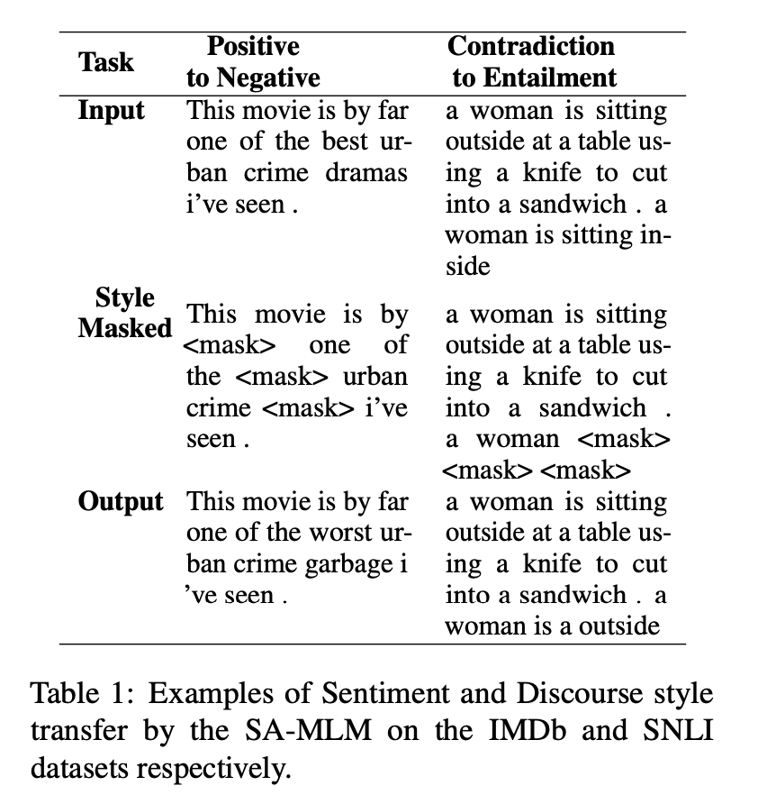

# Style Masked Language Model (SMLM)
This repo contains the code and data of the following paper:  
"On Text Style Transfer via Style-Aware Masked Language Models" 
*Sharan Narasimhan, Pooja Shekar, Suvodip Dey, Maunendra Sankar Desarkar*
(Proceedings of INLG 2023)

  

    
  

  

    
  

# Requirements
Pytorch, sklearn, nltk

# How to run
## Download the datasets (yelp, voices, tenses, snli, scitail, ppr)
Download the 'data' folder from: https://drive.google.com/drive/folders/1ZvAPAfd_pGFb37vA9gOyTBUiEOgPmHBJ?usp=sharing
Place the 'data' folder in the project directory.

## Run the preprocessing scripts
Run cells in `preprocess.ipynb` to preprocess the datasets

## Produce style masked datasets
Run `python test.py --style-masking <dataset>` to produce a style masked version of the dataset

## Train the SMLM
Run `python train.py --train <dataset-train-split> --valid <dataset-valid-split>`

## Testing and inference
`test.py` has all the experiments coded into it, refer to the params for more on what experiments can be performs

## Citation
Coming soon.

